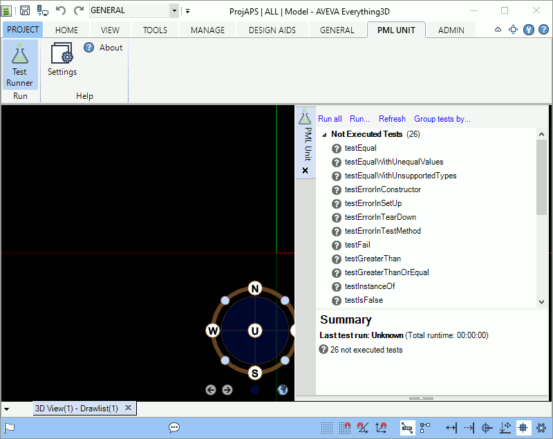

# PML Unit

PML Unit is a test framework for the PML programming language and a test runner
for PML code in AVEVA Everything3D, PDMS, and other products.

## Installation

[Download](https://github.com/PoByBolek/PmlUnit/releases/latest) and unpack
PML Unit to a directory of your choice. For example, if you unpacked the ZIP
file to `D:\pml-unit`, you should have the following directory tree:

    D:\pml-unit
    |-- e3d-1.1
    |   |-- bin
    |   |   `-- PmlUnit.dll
    |   `-- caf
    |       |-- AdminAddins.xml
    |       |-- AdminCustomization.xml
    |       |-- DesignAddins.xml
    |       |-- DesignCustomization.xml
    |       `-- ...
    |-- e3d-2.1
    |   |-- bin
    |   |   `-- PmlUnit.dll
    |   `-- caf
    |       |-- AdminAddins.xml
    |       |-- AdminCustomization.xml
    |       |-- DesignAddins.xml
    |       |-- DesignCustomization.xml
    |       `-- ...
    |-- pdms-12.1
    |   |-- bin
    |   |   `-- PmlUnit.dll
    |   `-- caf
    |       |-- AdminAddins.xml
    |       |-- AdminCustomization.xml
    |       |-- DesignAddins.xml
    |       |-- DesignCustomization.xml
    |       `-- ...
    |-- pmllib
    |   |-- pml-unit
    |   |   |-- pmlassert.pmlobj
    |   |   `-- pmltestrunner.pmlobj
    |   `-- pml.index
    `-- pmllib-tests
        |-- pml-unit-tests
        |   `-- ...
        `-- pml.index

Then you need to set the `CAF_ADDINS_PATH`, `CAF_UIC_PATH`, and `PMLLIB`
environment variables in your start scripts as follows:

| Platform  | `CAF_ADDINS_PATH`           | `CAF_UIC_PATH`              | `PMLLIB`             |
| --------- | --------------------------- | --------------------------- | -------------------- |
| PDMS 12.1 | `D:\pml-unit\pdms-12.1\caf` | `D:\pml-unit\pdms-12.1\caf` | `D:\pml-unit\pmllib` |
| E3D 1.1   | `D:\pml-unit\e3d-1.1\caf`   | `D:\pml-unit\e3d-1.1\caf`   | `D:\pml-unit\pmllib` |
| E3D 2.1   | `D:\pml-unit\e3d-2.1\caf`   | `D:\pml-unit\e3d-2.1\caf`   | `D:\pml-unit\pmllib` |

For example, for Everything3D 2.1 you could set the environment variables in
your `custom_evars.bat` in your projects directory:

    set CAF_ADDINS_PATH=D:\pml-unit\e3d-2.1\caf
    set CAF_UIC_PATH=D:\pml-unit\e3d-2.1\caf
    set PMLLIB=%PMLLIB%;D:\pml-unit\pmllib

### Note for PDMS 12.1

Note that for PDMS 12.1 you will have to edit the `*Addins.xml` and
`*Customization.xml` files in `D:\pml-unit\pdms-12.1\caf` so that they contain
absolute paths to the `PmlUnit.dll` and `PmlUnit.uic`, respectively.
Unfortunately, PDMS does not load addins and UIC files with path names relative
to the `CAF_ADDINS_PATH` and `CAF_UIC_PATH` environment variables.

For example, if you want PML Unit to show up in the PDMS Design module, you
should edit the `D:\pml-unit\pdms-12.1\caf\DesignAddins.xml` file like this:

    <?xml version="1.0" encoding="utf-8"?>
    <ArrayOfString xmlns:xsd="http://www.w3.org/2001/XMLSchema" xmlns:xsi="http://www.w3.org/2001/XMLSchema-instance">
        <string>ExplorerAddin</string>
        <string>DrawListAddin</string>
        <string>MyDataAddin</string>
        <string>HistoryAddin</string>
        <string>ReferenceListAddin</string>
        <string>PipeCheckAddin</string>
        <string>OutputAddin</string>
        <string>FindAddin</string>
        <string>LinksAddin</string>
        <string>AttributesUtility</string>
        <string>StatusControllerAddin</string>
        <string>ModelChangesAddin</string>
        <string>SVGCompare</string>
        <string>InstrumentationImportAddin</string>
        <string>AvevaNetExportConfigAddin</string>
        <string>ReportingAddin</string>
        <string>D:\pml-unit\pdms-12.1\bin\PmlUnit</string>
    </ArrayOfString>

You should also edit the `D:\pml-unit\pdms-12.1\caf\DesignCustomization.xml`
file like this:

    <?xml version="1.0" encoding="utf-8"?>
    <UICustomizationSet xmlns:xsd="http://www.w3.org/2001/XMLSchema" xmlns:xsi="http://www.w3.org/2001/XMLSchema-instance">
        <UICustomizationFiles>
            <CustomizationFile Name="Module" Path="design.uic" />
            <CustomizationFile Name="StatusControllerAddin" Path="StatusController.uic" />
            <CustomizationFile Name="SchematicExplorerAddin" Path="CoreSchematicMenu.uic" />
            <CustomizationFile Name="Project" Path="$1.uic" />
            <CustomizationFile Name="SVGCompare" Path="SVGCompare.uic" />
            <CustomizationFile Name="PmlUnit" Path="D:\pml-unit\pdms-12.1\caf\PmlUnit.uic" />
        </UICustomizationFiles>
    </UICustomizationSet>

----------------

## Writing Tests

To write tests you have to create PML object files (`.pmlobj`) and reference
them in your `pml.index` file like any other PML file.

Test cases are objects whose name ends with `Test` and contain one ore more test
methods. A test method accepts a single `PmlAssert` parameter and has a name
beginning with `.test`. In addition, test cases may also have initialization and
clean up methods: `.setup()` and `.tearDown()`. See [Running Tests](#running-tests)
for an explanation of the test execution order.

### Anatomy of a Test Case

    define object ExampleTest
    endobject

    -- Optional method that runs once before each test in this test case.
    define method .setup()
    endmethod

    -- Optional method that runs once after each test in this test case
    -- regardless of the test outcome.
    define method .tearDown()
    endmethod

    define method .testSomething(!assert is PmlAssert)
        !assert.equal(1 + 1, 2)
    endmethod

    define method .testSomethingThatFails(!assert is PmlAssert)
        !assert.fail('This test always fails.')
    endmethod

### Assertions

The [`PmlAssert` object](pmllib/pml-unit/pmlassert.pmlobj) has a number of
methods that allow you to make assertions in your tests.

#### .equal(!left is Any, !right is Any)
Passes if `!left eq !right` returns `true`, fails otherwise.

#### .notEqual(!left is Any, !right is Any)
Passes if `!left ne !right` returns `true`, fails otherwise.

#### .lessThan(!left is Any, !right is Any)
Passes if `!left lt !right` returns `true`, fails otherwise.

#### .lessThanOrEqual(!left is Any, !right is Any)
Passes if `!left le !right` returns `true`, fails otherwise.

#### .greaterThanOrEqual(!left is Any, !right is Any)
Passes if `!left ge !right` returns `true`, fails otherwise.

#### .greaterThan(!left is Any, !right is Any)
Passes if `!left gt !right` returns `true`, fails otherwise.

#### .isSet(!value is Any)
Passes if `!value.set()` returns `true`, fails otherwise.

#### .isUnset(!value is Any)
Passes if `value.unset()` returns `true`, fails otherwise.

#### .isTrue(!value is Boolean)
Passes if `!value` is `true`, fails otherwise. Note that `object Boolean()` is
neither `true` nor `false`.

#### .isFalse(!value is Boolean)
Passes if `!value` is `false`, fails otherwise. Note that `object Boolean()` is
neither `true` nor `false`.

#### .instanceOf(!object is Any, !objectType is String)
Passes if `!object.objectType()` is equal to `!objectType`, fails otherwise.
Note that the `.objectType()` method usually returns uppercaes object names,
i.e. even if you define your object as `define object ExampleTest` it would
still return `EXAMPLETEST`.

#### .fail()
Fails unconditionally.

All of the above assertions have an additional override that allows you to pass
your own error message as the last parameter to them, for example
`!assert.equal(1, 2, 'This should never work')`.

----------------

## Running Tests

PML Unit scans the `pml.index` files for test cases (`*Test.pmlobj`) and looks
for test methods (`.test*(PmlAssert)`) in those files. When you run tests, PML
Unit calls the following methods on your test cases for every test method:

1. The default (parameterless) object constructor.
2. The `.setup()` method if the test case contains one.
3. The actual test method.
4. The `.tearDown()` method if the test case contains one.

If you were to run all test methods in the `ExampleTest` test case from the
[Anatomy of a Test Case example](#anatomy-of-a-test-case), PML Unit would
roughly do the following:

    !testCase = object ExampleTest()
    !testCase.setup()
    !testCase.testSomething(object PmlAssert())
    !testCase.tearDown()

    !testCase = object ExampleTest()
    !testCase.setup()
    !testCase.testSomethingThatFails(object PmlAssert())
    handle ANY
        !testCase.tearDown()
    endhandle

However, you should note that PML Unit does *not* guarantee a particular order
for individual tests, i.e. it may decide to execute `testSomethingThatFails`
before `testSomething`. But your tests shouldn't depend on execution order
anyway ;-).

----------------

## Building

Download the source code to a directory of your choice. The examples in the
following sections assume that the root directory of the source code is at
`D:\pml-unit`.

The solution and project files define one platform configuration for each of PML
Unit's supported platforms: PDMS 12.1, E3D 1.1, and E3D 2.1. You can build PML
Unit for only one platform or for all platforms at once.

### Dependencies

Copy the `Aveva.ApplicationFramework.dll`, `Aveva.ApplicationFramework.Presentation.dll`,
and `PMLNet.dll` from your PDMS or Everything3D installation directory into the
corresponding `lib` directory in your PML Unit source root. For example, if you
unpacked the PML Unit sources to `D:\pml-unit` and installed Everything3D and/or
PDMS to their default locations, you should copy the DLLs as follows:

| Platform  | Default Source                                  | Destination                 |
| ----------| ------------------------------------------------| --------------------------- |
| PDMS 12.1 | `C:\AVEVA\Plant\PDMS12.1.SP4`                   | `D:\pml-unit\lib\PDMS 12.1` |
| E3D 1.1   | `C:\Program Files (x86)\AVEVA\Plant\E3D1.1.0`   | `D:\pml-unit\lib\E3D 1.1`   |
| E3D 2.1   | `C:\Program Files (x86)\AVEVA\Everything3D2.10` | `D:\pml-unit\lib\E3D 2.1`   |

The test project additionally depends on the Nunit and Moq nuget packages. You
can install them using

    nuget restore

### Compiling

Once you have installed the dependencies, you can select your target platform
and build configuration in Visual Studio and build the solution or just the
PmlUnit project.

You may also build the solution or the PmlUnit project using MSBuild from a
Visual Studio command prompt:

    MSBuild /p:Configuration=Release "/p:Platform=PDMS 12.1" PmlUnit.sln
    MSBuild /p:Configuration=Release "/p:Platform=E3D 1.1" PmlUnit.sln
    MSBuild /p:Configuration=Release "/p:Platform=E3D 2.1" PmlUnit.sln

----------------

## License

PML Unit is licensed under the MIT license.

The test status icons are taken from [Font-Awesome-SVG-PNG][fa-svg], which is
licensed under the MIT license.

The [test runner icon][iconfinder] was created by [Recep Kütük][recep-kutuk] and
is free for personal and commercial use.

  [fa-svg]: https://github.com/encharm/Font-Awesome-SVG-PNG
  [iconfinder]: https://www.iconfinder.com/icons/728987/chemistry_experiment_lab_laboratory_research_science_test_icon
  [recep-kutuk]: http://www.recepkutuk.com/bitsies/
